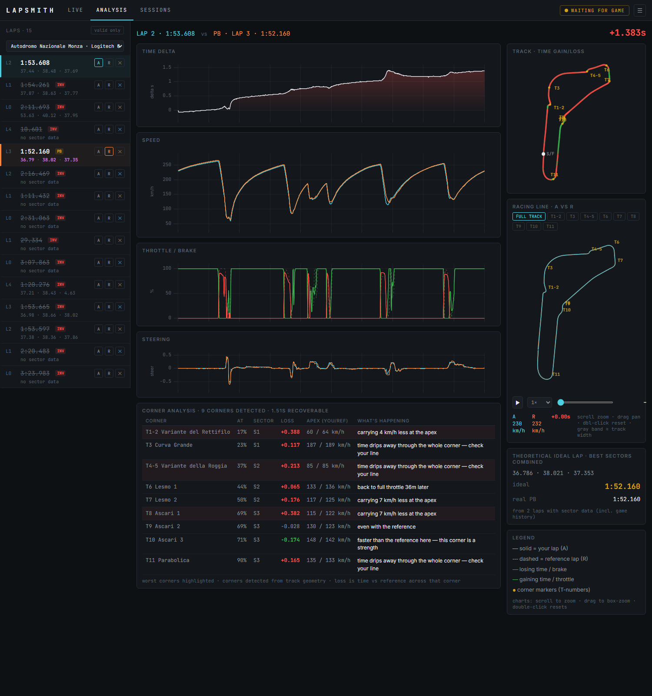

# Lapsmith

**Forge better laps.** A free, open-source telemetry platform for sim racing —
record every lap you drive, see corner-by-corner where the time is lost, and
watch any two laps race each other as ghosts.



## Why Lapsmith

Most drivers know *that* they're slow somewhere. Telemetry tools show you
*where*. Lapsmith goes one further and tells you *why* — in plain English:

> **T4-5 Variante della Roggia · +1.427s** — carrying 11 km/h less at the
> apex; back to full throttle 16m later

## Features

- **Corner-by-corner coaching** — corners detected automatically from the
  geometry of your driven line, matched to their real names, each scored
  with time lost/gained, braking point, apex speed, and throttle comparison
- **Ghost playback** — two laps replay on a shared clock around the track
  map; scrub, slow-mo, and watch exactly where the reference pulls away
- **Racing line comparison** — both driven lines overlaid inside the real
  track corridor, zoomable per corner
- **Time-delta analysis** — the classic delta curve plus speed / pedals /
  steering traces on a synced distance axis with sector and corner markers
- **Full lap history** — imports your past lap and sector times straight
  from the game's own session logs, back to your first drive
- **Personal bests & the ideal lap** — PBs tracked per track + car, plus a
  theoretical best from your fastest sectors combined
- **Session library** — every stint grouped by track, color-coded by
  session type, purple-highlighted best sectors
- **Cut-lap protection** — laps the sim refuses to count (track cuts,
  resets, quitting mid-lap) can never become your PB
- **Runs 100% locally** — your data stays on your machine, in an open
  SQLite + NumPy format you can inspect yourself

## Supported sims

| Sim | Status |
| --- | ------ |
| Le Mans Ultimate | ✅ supported (shared memory, live + history import) |
| iRacing | 🔜 planned — adapter architecture is ready |
| Assetto Corsa Competizione | 🔜 planned |
| Assetto Corsa | 🔜 planned |

Adding a sim means writing **one adapter** (~150 lines): everything else —
recording, analysis, UI — is sim-agnostic. Contributions welcome.

## Quick start

```powershell
git clone https://github.com/tatewamola-web/lapsmith
cd lapsmith
# engine (Python 3.10+)
uv venv engine\.venv && uv pip install -e engine --python engine\.venv
# ui (Node 20+)
cd ui && npm install && npm run build && cd ..
# run — opens http://localhost:8000
./scripts/lapsmith.ps1              # Le Mans Ultimate
./scripts/lapsmith.ps1 -Adapter sim # demo mode, no game needed
```

For LMU: enable **Settings → Gameplay → Enable Plugins**, then drive.
Details in [docs/SETUP_LMU.md](docs/SETUP_LMU.md).

## How it works

```
┌──────────────┐  normalized   ┌───────────────┐  REST + WebSocket  ┌──────────┐
│ Game adapter  │ ── frames ──▶ │ Engine         │ ─────────────────▶ │ UI        │
│ (LMU, sim...) │   (50 Hz)     │ record·analyze │                    │ React     │
└──────────────┘               └───────────────┘                    └──────────┘
```

Laps are compared **by track position, not by time**, so corners line up
between any two laps — the same principle professional motorsport telemetry
uses. The full build story, including every bug reality threw at us, lives
in [DEVLOG.md](DEVLOG.md).

## Roadmap

- In-game overlay widgets (live delta bar, input traces, track map)
- More sims (iRacing first)
- Lap file sharing (`.lapsmith` files already export/import)
- Community reference laps

## Contributing & community

Issues, ideas, and adapter contributions are all welcome — open an
[issue](https://github.com/tatewamola-web/lapsmith/issues) or a PR.
If Lapsmith helped you find time, a ⭐ helps others find Lapsmith.

Built by [Tate Wamola](https://github.com/tatewamola-web), a high-school
sim racer who wanted to know where the tenths were hiding. MIT licensed.
